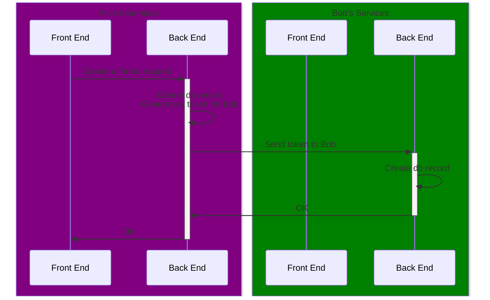
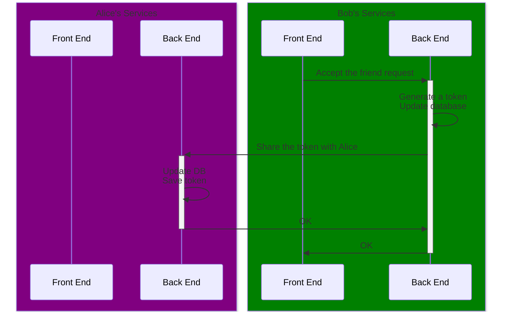
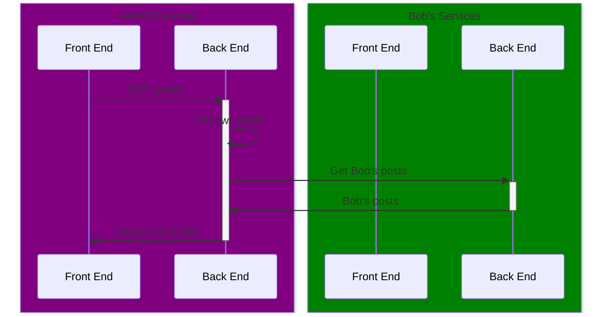

# private-network

This is going nowhere

# Generate keys

```shell
mkdir .keys
cd .keys
openssl genrsa -out private-key.pem 2048
openssl rsa -in private-key.pem -out public-key.pem -pubout -outform PEM
```

# Environment

Create an `.env` file in `back-end` with the following:

```properties
DOMAIN=<the domain here>
```

Create an `.env` file in `front-end` with the following:

```properties
VITE_BACKEND=http://localhost:51055
```

# Deploy

```shell
cd docker
yarn deploy
```

# Database

<!-- Source: https://www.baeldung.com/openssl-self-signed-cert -->

```shell
mkdir .keys
cd .keys
openssl genrsa -out domain.key 2048 # -des3 add this if we want it the key encrypted
openssl req -key domain.key -new -out domain.csr
openssl x509 -signkey domain.key -in domain.csr -req -days 365 -out domain.crt
openssl pkcs12 -inkey domain.key -in domain.crt -export -out domain.pfx
```

# Add friend

## Alice creates the link



## Bob accepts the invite link



## Alice browses her posts


